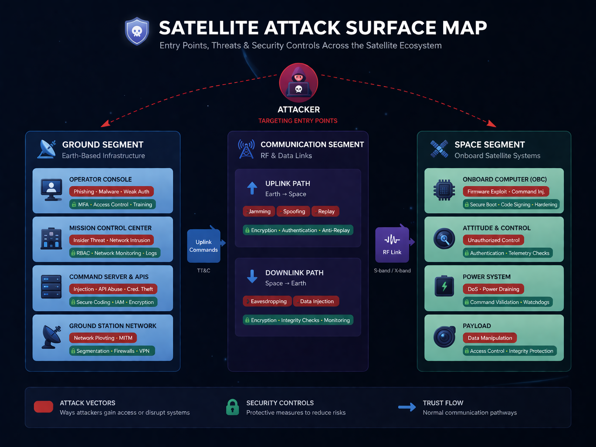
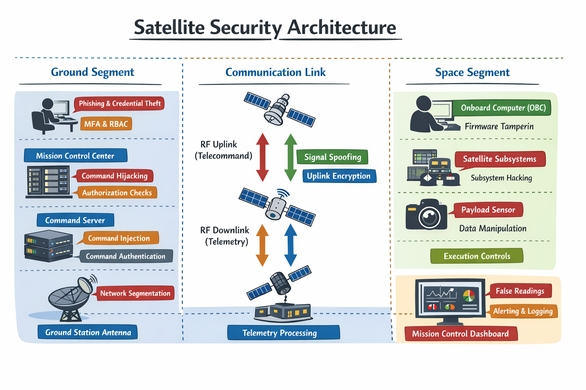

# 🛰️ Satellite Threat Model

Beginner Space Cybersecurity Project – Satellite Threat Modeling

---

## 📌 Overview

This project presents a beginner-level satellite threat model that analyzes cybersecurity risks across the three major space system segments:

- Ground Segment
- Communication Segment
- Space Segment

The objective is to understand how attackers could target satellite infrastructure and how security controls can mitigate those risks.

---

## 🎯 Project Objective

This project demonstrates:

- Identification of satellite system assets
- Entry point discovery
- Attack surface analysis
- Attack chain modeling
- Security control recommendations

This serves as an entry-level portfolio project in Space Cybersecurity.

---

## 🛰️ Satellite Communication Architecture

Mission Control
↓
Command Server
↓
Ground Station Network
↓
RF Antenna (Uplink)
↓
Satellite Communication System
↓
Onboard Computer (OBC)
↓
Satellite Subsystems
↓
Payload
↓
Telemetry Downlink
↓
Ground Station Receiver

---

## 🎯 Satellite Attack Surface Map

This diagram highlights major cybersecurity attack surfaces across the satellite ecosystem, including the ground segment, RF communication links, and onboard spacecraft subsystems. It illustrates how attackers may target mission control systems, command servers, telecommand uplinks, onboard computers, payload sensors, and telemetry pipelines.

---

## 🧩 Satellite Security Architecture Diagram

This diagram illustrates the end-to-end satellite communication architecture including the ground segment, RF communication layer, onboard spacecraft subsystems, payload pipeline, and telemetry return path along with major cybersecurity attack surfaces.

---

## 🎯 Assets Identified

| Asset | Importance |
|------|-----------|
| Satellite | Mission-critical system |
| Command Server | Controls satellite behavior |
| Ground Station | Communication infrastructure |
| Telemetry Data | Satellite health monitoring |
| RF Communication Link | Command and data transfer |

---

## 🚪 Entry Points

Potential attacker entry points include:

- Mission control dashboards (web interfaces)
- Ground station internal networks
- Command APIs
- RF uplink/downlink communication channels

---

## ⚠️ Threat Analysis

### 🌍 Ground Segment Threats

- Web vulnerabilities (XSS, SQL Injection)
- Weak authentication mechanisms
- Phishing attacks targeting operators
- Insider access misuse

### 📡 Communication Segment Threats

- RF jamming
- Signal spoofing
- Replay attacks
- Signal interception

### 🛰 Space Segment Threats

- Firmware vulnerabilities
- Command injection
- Payload manipulation
- Unauthorized subsystem control

---

## 🔗 Attack Chain Example 1 — Ground Station Compromise
Attacker
↓
Phishing Email
↓
Credential Theft
↓
Ground Station Access
↓
Command Server Compromise
↓
Malicious Commands Sent
↓
Satellite Executes Commands

---

## 🔗 Attack Chain Example 2 — RF Spoofing Attack
Attacker
↓
Fake RF Signal Transmission
↓
Satellite Receiver Accepts Signal
↓
Fake Commands Executed
↓
Satellite Behavior Altered

---

## 🛡 Security Controls

| Area | Control |
|------|--------|
| Command System | Authentication & Authorization |
| Communication Link | Encryption |
| Ground Infrastructure | Network segmentation & firewall protection |
| Monitoring | Logging and anomaly detection |

---

## 📊 Risk Summary

| Risk | Impact |
|------|--------|
| Ground station compromise | Full satellite control |
| RF spoofing | Unauthorized command execution |
| RF jamming | Communication disruption |
| Firmware exploitation | Satellite takeover risk |

---

## 📊 Satellite Security Threat Assessment Summary

This section provides a structured cybersecurity assessment of a representative satellite communication architecture across the ground, communication, and space segments.

### Threat Model Scope

The assessment evaluates risks affecting:

- Ground Segment (mission control center, operator consoles, command servers)
- Communication Segment (RF uplink and telemetry downlink channels)
- Space Segment (onboard computer, satellite subsystems, payload instruments)

---

### High-Impact Threat Scenarios

#### 1. Ground Segment Compromise

Attack Path:

Attacker → Phishing Email → Operator Credential Theft → Mission Control Access → Command Server Exposure → Unauthorized Telecommand Transmission

Impact:

Potential spacecraft orientation manipulation, payload misuse, or communication disruption.

---

#### 2. RF Signal Spoofing Attack

Attack Path:

Attacker → Fake RF Transmission → Satellite Receiver Accepts Signal → Unauthorized Command Execution

Impact:

Command hijacking and mission integrity compromise.

---

#### 3. Telemetry Manipulation Attack

Attack Path:

Attacker → Telemetry Processing System Access → Data Alteration → False Status Displayed to Operators

Impact:

Delayed anomaly detection and attacker persistence inside mission infrastructure.

---

### Security Control Recommendations

| Layer | Recommended Control |
|------|--------------------|
Operator Access | Multi-Factor Authentication (MFA) |
Mission Control Systems | Role-Based Access Control (RBAC) |
Command Infrastructure | Command Authentication & Logging |
RF Communication Links | Encryption & Anti-Replay Protection |
Satellite OBC | Secure Boot & Command Validation |

---

### Risk Prioritization Matrix

| Threat | Risk Level |
|-------|------------|
Command Injection | Critical |
Telemetry Manipulation | High |
RF Spoofing | High |
RF Jamming | Medium |
Payload Tampering | Medium |

---

### Assessment Outcome

This project demonstrates a structured satellite cybersecurity threat model covering system architecture, command-channel risks, telemetry integrity threats, RF-layer attack surfaces, and mitigation strategies aligned with modern spacecraft operations security practices.

---
## 🚀 Future Improvements

Planned next steps for extending this satellite security assessment:

- Perform RF signal monitoring using RTL-SDR hardware
- Analyze CCSDS telemetry packet structures
- Simulate telecommand injection scenarios in a controlled lab setup
- Expand the threat model using the STRIDE methodology
- Build a satellite telemetry decoder prototype in Python

---

## 👨‍💻 Author

Ashish Kumar Giri  
Cybersecurity Engineer (VAPT → Space Cybersecurity Transition)

---

## ⭐ Project Status

Completed as part of a structured Space Cybersecurity learning roadmap (Month 1 – Satellite Systems & Threat Modeling).

